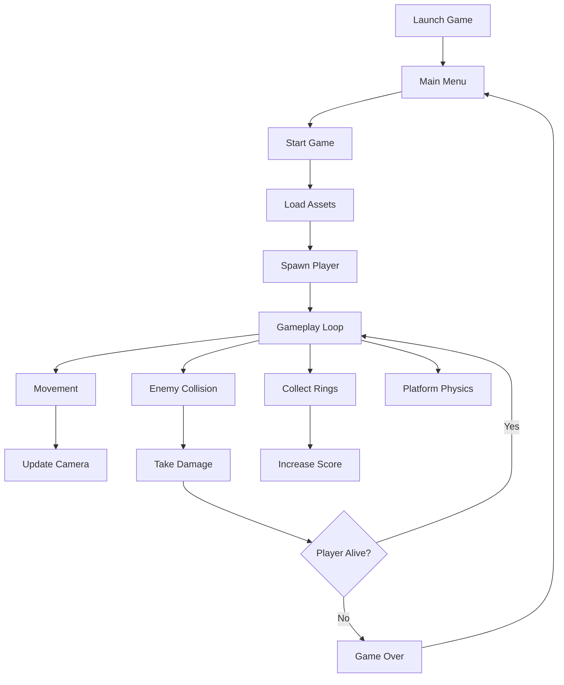

# Odyssey: Imagine's Travels


[](https://kaplayjs.com)

> A browser-based side-scrolling platformer built with JavaScript and Kaplay.

**Odyssey** is a fast-paced 2D platformer where players controls *Imagine*, collecting rings, avoiding enemies, and surviving increasingly challenging platform sections.

Built as an exploration into browser-based game development, the project focuses on player movement, collision systems, sprite animation, collectibles, enemy interactions, and scene management while maintaining a pixel-driven lightweight architecture powered entirely by JavaScript.


## Features

- Side-scrolling platform gameplay
- Character movement and jumping physics
- Collision detection
- Ring collection mechanics
- Health and damage system
- Animated sprites
- Multiple game scenes
- Main Menu
- Game Over screen
- Background music
- Sound effects
- Responsive browser gameplay

---

# Architecture



---

# Installation
```bash
git clone https://github.com/LordPrettyRustyRyan/Odyssey.git

cd Odyssey

npm install

npm run dev
```

---

## Roadmap

- [x] Mobile controls
- [ ] Multiple levels
- [ ] Shoot
- [ ] Save system
- [ ] New enemies
- [ ] Power-ups
- [ ] Add rings distant above platforms - jump to get them.
- [ ] Multiple Platforms

---

## Contributions

Suggestions and improvements are always welcome.
